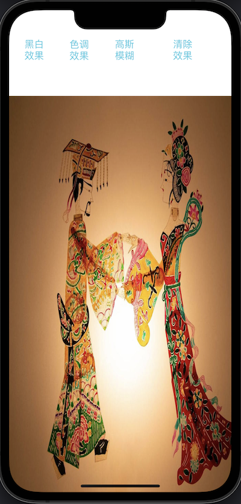
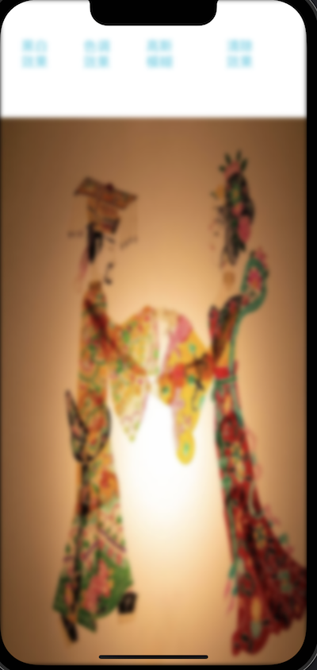
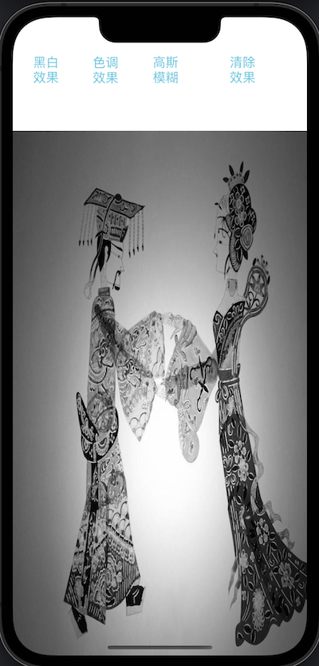

# WJEffectView
色调特效，黑白特殊，高斯模糊

```objective-c
// 添加色调特效
[WJEffectView addEffectViewToView:self.imageView tintColor:[UIColor colorWithWhite:0.11 alpha:0.73]];
```

```objective-c
// 添加黑白色调特效
[WJEffectView addGrayEffectViewToView:self.imageView];
```

```objective-c
// 添加高斯模糊特效
[WJEffectView addBlurEffectFilterToView:self.imageView radius:3];
```

```objective-c
// 清除特效
[WJEffectView clearEffectForView:self.imageView];
```


无特效		高斯模糊   	黑白效果
 

 




